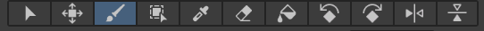

# Farming-Game---Course
Udemy 的课程 Learn To Create A Farming Game With Unity 6 &amp; C# 的笔记。

课程地址如下：[Learn To Create A Farming Game With Unity 6 & C# | Udemy](https://www.udemy.com/course/unity6-farming/?couponCode=MT130825G1)

## Section 1: Introduction

本次课程的所有素材可以在仓库的 `./Resources/UdemyFarmingAssets-JamesDoyle.unitypackage` 中找到，请在开始前导入到 Unity 当中，直接将文件拖入 Unity 的素材库即可。

## Section 2: Getting Started

### Setting Up The Project

本项目在 Unity 6 中进行，国内可能需要用魔法在外网官网手动下载安装。

首先删除本项目中无需用到的包，点击左上角菜单栏 Windows -> Package Manager，Remove 删除以下包：`Visual Scripting`、`Timeline`、`Multiplayer Center`、`JetBrains Rider Editor`、`Test Framework`。

然后将 Unity 的工作视图调整为下面这样即可开始咯：


## Section 3: Tiles & Tilemaps

### Creating Tiles

首先要做的第一件事就是开始设置要使用的场景。左上角菜单栏：File -> New Scene -> Lit 2D(URP)，然后在 Hierachy 中删除不需要的灯光 Global Light 2D。接着 Ctrl + S 保存在 Assets > Scenes 并给场景命名为 `Main`。（这里如果刚开始有自带的场景 Simple Scene，也可以直接将其重命名为 Main 来使用）

这里将使用瓦片 Tile Map 地图系统来布局我们的游戏场景，使场景统一。在素材库中进入导入的资源，然后进入以下路径：Art > Tiny Wonder Farm > Tilemaps，展开 summer farm tilemap 资源可以看到很多的素材。点击左上角菜单栏 Windows -> 2D -> Tile Palette，可以将此栏拖放到检查器旁边，首先点击 Create New Tile Palette 新建一个图块调色板，将其命名为 `Outdoor Ground`，并放在 Assets > Tiles > Outdoor Ground 文件下（自行新建一个 `Tiles` 和 `Outdoor Ground` 文件夹）。Tile Palette 中 Drag Tile, Sprite, Texture... 提示我们将素材拖入，我们将 summer farm tilemap 资源折叠然后整个拖入，将其保存在 Assets > Tiles > Outdoor Ground。为了更好的预览，可以将这个界面的下边界往下拖以放大界面。现在我们基本上已经拥有了想要的所有的瓦片和调色板。

### Using Tilemaps For The Ground

接下来绘制瓦片，左上角的菜单栏 GameObject -> 2D Object -> Tilemap -> Rectangular，将其命名为 `Ground`。于是看到场景里有了网格 Gird，和可以在上面绘制的 `Ground`。

回到 Tile Palette 简单介绍以下几个常用的绘制工具：



- 从左往右第三个工具：也就是现在选择的这个是画笔，可以允许我们使用鼠标随意画瓦片。
- 从左往右第四个工具：允许我们使用矩形工具画出大量瓦片。
- 从左往右第六个工具：橡皮擦工具。

我们会发现如果我们填入非整格填满的瓦片的话，就会露出透明的部分，就像下面这样。


解决这个问题的办法就是以这个绿色为底层背景，再在上面添加一层瓦片集。右键 Grid，2D Object -> Tilemap -> Rectangular，将其命名为 `Ground Overlay`，选中之后即可在第一层绿色背景上画新的一层而且不会露出透明部分。

当你第一次放瓦片的时候，你可能看不到你放的这些东西。进入两个 Tilemap 的监视器中，在 Tilemap Renderer 的 Additional Settings 下会看到 Order in Layer 的属性，也就是他们的优先级，此时你会发现这两个 Tilemap 的顺序都是 0，这个时候我测试游戏 Unity 就会随机决定将这两个 Tilemap 中的其中一个显示在另一个之上。因为我想要 `Ground Overlay` 覆盖在 `Ground` 上，因此我们要给它的Order in Layer 设置的比 0 大，这里设置为 `5`。

## Section 4: The Player

### Setting Up The Player

有了场景以后，接下来需要一个可以走动的角色。在 Hierarchy 中右键 Create Empty，新建一个对象并将其命名为 `Player`。我们导入的资源中 Art > Tiny Wonder Farm > Character 中有非常多可供使用的角色图像资源。选择 walk and idle 中的第三个图像，将其拖拽到 Scene 场景当中。此时 Hierarchy 中会出现一个新的对象 `walk and idle_2`，将其重命名为 `Sprite`。接着我们将 Sprite 拖拽到 Player 下。为了使角色在正中心，可以将其 Position 的 X, Y, Z 设置为 `0, 0, 0`，并且我们依旧可能无法在测试时看到角色，同理我们需要将其 Order in Layer 设置为大于 0 的值。

不过再想一下，如果每次我们新的角色，每次都为这个角色都设置 Order in Layer 是很头疼且麻烦的，所以此时我们点击上面 Sorting Layer 的 Default，选择 Add Sorting Layer...，接着会出现一个图层列表，我们在 Sorting Layers 下面点击加号添加新的层，添加两个层，将 `Layer 1` 命名为 `Player`，将 `Layer 2` 命名为 `Ground`。此时加上默认的 `Layer 0` 一共有三个层，这里的 Layer 越大表示其优先级越高，越优先被看到，所以看的顺序是优先从列表底部向顶部的顺序。我们希望玩家始终可见，于是拖动 Layer 改变层的顺序，最终 `Layer 0` 为 `Ground`，`Layer 1` 为 `Default`， `Layer 2` 为 `Player`。

设置完后，回到 Player 下 Sprite 的监视器，将其 Sorting Layer 设置为 `Player`。接着也可以将之前Grid 下的 Ground 和 Ground Overlay 的 Sorting Layer 也设置为 `Ground`（Order in Layer 只对同一 Sorting Layer 生效）。现在真正重要的是我们有了层号顺序！

现在我们要添加所谓的碰撞体 rigid body，碰撞体能够使用 Unity 的输入或内置物理系统。选中 Hierarchy 中的 Player，在其监视器中选择 Add Component 添加新的组件，选择 Physics 2D -> Rigidbody 2D（或直接搜索 Rigidbody 2D）。此时测试游戏，你会发现角色下落了，这里需要将碰撞体的 Gravity Scale 从 1 改为 `0`。

### Setting Up Our First Script

现在，我想要我们的玩家可以四处移动，因此需要脚本来控制角色。首先我们现在资料库中的 Assets 下新建一个用来存放脚本的文件夹 `Scripts`。在 Scripts 文件夹下新建脚本，右键 Create -> MonoBehaviour Script（*Unity 6 中将脚本命名为 MonoBehaviour Script，如果在旧的 Unity 中就是 C# Script*），将其命名为 `PlayerController`。

接着需要将这个脚本与角色绑定起来，将脚本拖入 Player 监视器空白部分即可，在监视器中双击这个脚本就可以用 Visual Studio 编译器打开脚本文件了。此时会看到已经自动为我们写好了两个函数的框架，也对这两个函数的作用做了解释：

- Start()：在 MonoBehavior 创建后首次执行 Update 之前，Start() 函数会被调用一次。
- Update()：每帧调用一次 Update() 函数。

我们知道，现在这里的 Rigidbody 碰撞体控制着我们角色的物理特性，我们想用它来让我们的玩家四处移动。虽然创建的脚本与物体的相关属性在同一个位置，但是脚本无权直接访问与控制这些属性。而一般的做法是创建一个变量。

所以下面这里创建一个名为 `the RB` 的 Rigidbody 2D 类的变量（创建对 Rigidbody 2D 这个组件类型的引用）：

```c#
public Rigidbody2D theRB;
```

此时回到 Unity，会发现 Player 的检查器中多了一个我们刚刚创建好的变量 `The RB`。不过此时它的值是 `None`，你需要将检查器中的 Rigidbody 2D 拖动到下面的 `The RB` 处，或者从 Hierarchy 的场景中将 Player 拖入 `The RB` 中（因为 Player 包含 Rigidbody 2D）。当然，这里如果你不想让在脚本中创建的变量能在 Unity 中被看到且随意修改，你可以将这个变量从 public 改为 private。不过，你也可以点击检查器最右边的省略号，将 Normal 改成 Debug，在调试模式下你也依旧能看到 private 的私有变量。

### Moving The Player

为了让角色移动起来，我们回到脚本给角色创建一个新的变量 `moveSpeed` 用来表示角色的移动速度：

```c#
public float moveSpeed;
```

回到 Unity 就会发现 Player 多了一个 `Move Speed` 的变量，我们可以将其值设置为 `8` 先。

此时如果我们在 Update() 函数中写入：

```c#
theRB.linearVelocity = new Vector2(moveSpeed, 0f);
```

这里的意思是给 `theRB` 变量的 `linearVelocity` 水平增加 `(moveSpeed, 0f)`，这里的 Vector2 新变量包含两个值，一个为 X 轴的值，一个为 Y 轴的值，这里向实现水平移动，所以第一个值是移动的速度，第二个值是 `0f`（`0f` 的意思是浮点数的 0，如果只写 `0` 就是 int 类型的数字 0）。前面说过 Update() 函数每一帧都会调用一次，所以这里每一帧都会增加角色的 X 轴的坐标，开启调试的效果就是角色一直往右边走。

### Controlling The Player

现在来说明如何控制玩家的移动。因此，我们想要做的当然是能够捕捉来自玩家的输入，知道玩家按下了什么来控制实际角色。

好消息是，Unity 内置了一个完整的输入系统，默认设置了一堆东西来处理玩家的各种类型的输入，在 Project 资源库中的 Assets 中可以找到这个系统 InputSystem_Actions（三折叠地图的图标）。我们双击打开这个系统，展开 Move，就可以看到常见的 WASD 移动方式。

了解这个系统之后，我们便可以将其关闭然后回到脚本中了。创建一个 InputSystem Actions 中的类：

```c#
public InputActionReference moveInput;
```

回到 Unity，会看到 Player 多了变量 `Move Input`，不过此时其值为 `None`，点击右边中间有点的圈可以看到很多控制方式，我们选择 Player/Move，现在我们对输入系统上的运动动作有了参考。然后将我们之前在 Update() 函数中的语句改成：

```c#
theRB.linearVelocity = moveInput.action.ReadValue<Vector2>() * moveSpeed;
```

回到 Unity 调试，此时使用 WASD 便可以控制我们的角色了。这里 `moveInput.action.ReadValue<Vector2>()` 是获取玩家输入的方向，乘上角色的移动速度便是整个移动的实现。
