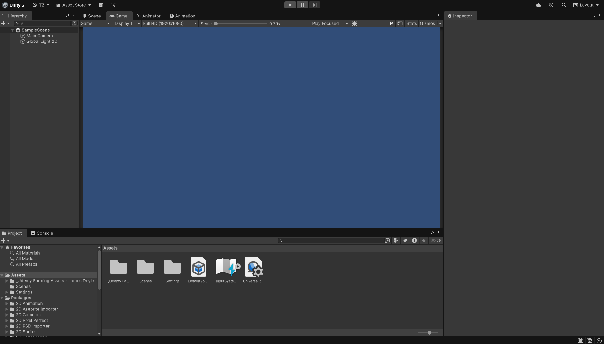

# Farming-Game---Course
Udemy 的课程 Learn To Create A Farming Game With Unity 6 &amp; C# 的笔记。

课程地址如下：[Learn To Create A Farming Game With Unity 6 & C# | Udemy](https://www.udemy.com/course/unity6-farming/?couponCode=MT130825G1)

## Section 1: Introduction

本次课程的所有素材可以在仓库的 `./Resources/UdemyFarmingAssets-JamesDoyle.unitypackage` 中找到，请在开始前导入到 Unity 当中，直接将文件拖入 Unity 的素材库即可。

## Section 2: Getting Started

### Setting Up The Project

本项目在 Unity 6 中进行，国内可能需要用魔法在外网官网手动下载安装。

首先删除本项目中无需用到的包，点击左上角菜单栏 Windows -> Package Manager，Remove 删除以下包：`Visual Scripting`、`Timeline`、`Multiplayer Center`、`JetBrains Rider Editor`、`Test Framework`。

然后将 Unity 的工作视图调整为下面这样即可开始咯：

## Section 3: Tiles & Tilemaps

### Creating Tiles

首先要做的第一件事就是开始设置要使用的场景。左上角菜单栏：File -> New Scene -> Lit 2D(URP)，然后在 Hierachy 中删除不需要的灯光 Global Light 2D。接着 Ctrl + S 保存在 Assets > Scenes 并给场景命名为 `Main`。（这里如果刚开始有自带的场景 Simple Scene，也可以直接将其重命名为 Main 来使用）

这里将使用瓦片 Tile Map 地图系统来布局我们的游戏场景，使场景统一。在素材库中进入导入的资源，然后进入以下路径：Art > Tiny Wonder Farm > Tilemaps，展开 summer farm tilemap 资源可以看到很多的素材。点击左上角菜单栏 Windows -> 2D -> Tile Palette，可以将此栏拖放到检查器旁边，首先点击 Create New Tile Palette 新建一个图块调色板，将其命名为 `Outdoor Ground`，并放在 Assets > Tiles > Outdoor Ground 文件下（自行新建一个 `Tiles` 和 `Outdoor Ground` 文件夹）。Tile Palette 中 Drag Tile, Sprite, Texture... 提示我们将素材拖入，我们将 summer farm tilemap 资源折叠然后整个拖入，将其保存在 Assets > Tiles > Outdoor Ground。为了更好的预览，可以将这个界面的下边界往下拖以放大界面。现在我们基本上已经拥有了想要的所有的瓦片和调色板。

### Using Tilemaps For The Ground

接下来绘制瓦片，左上角的菜单栏 GameObject -> 2D Object -> Tilemap -> Rectangular，将其命名为 `Ground`。于是看到场景里有了网格 Gird，和可以在上面绘制的 `Ground`。

回到 Tile Palette 简单介绍以下几个常用的绘制工具：

- 从左往右第三个工具：也就是现在选择的这个是画笔，可以允许我们使用鼠标随意画瓦片。
- 从左往右第四个工具：允许我们使用矩形工具画出大量瓦片。
- 从左往右第六个工具：橡皮擦工具。

我们会发现如果我们填入非整格填满的瓦片的话，就会露出透明的部分，就像下面这样。

解决这个问题的办法就是以这个绿色为底层背景，再在上面添加一层瓦片集。右键 Grid，2D Object -> Tilemap -> Rectangular，将其命名为 `Ground Overlay`，选中之后即可在第一层绿色背景上画新的一层而且不会露出透明部分。

当你第一次放瓦片的时候，你可能看不到你放的这些东西。进入两个 Tilemap 的监视器中，在 Tilemap Renderer 的 Additional Settings 下会看到 Order in Layer 的属性，也就是他们的优先级，此时你会发现这两个 Tilemap 的顺序都是 0，这个时候我测试游戏 Unity 就会随机决定将这两个 Tilemap 中的其中一个显示在另一个之上。因为我想要 `Ground Overlay` 覆盖在 `Ground` 上，因此我们要给它的Order in Layer 设置的比 0 大，这里设置为 `5`。
